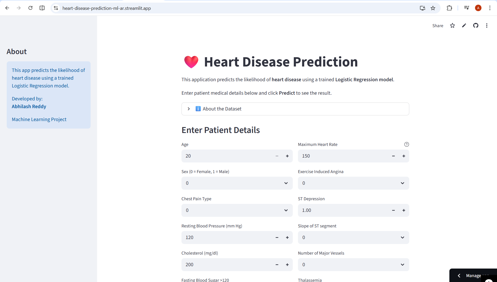
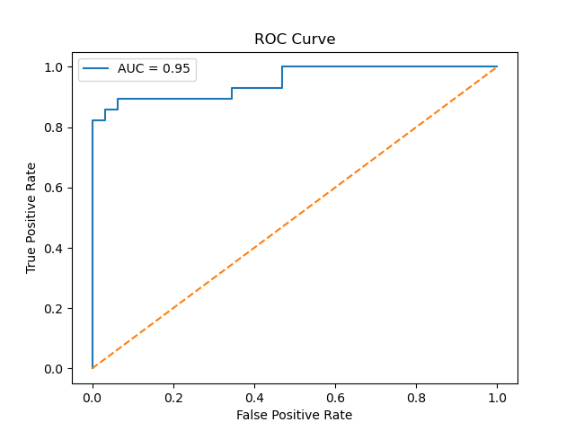

# ❤️ Heart Disease Prediction using Machine Learning

A machine learning project that predicts the likelihood of heart disease using **Logistic Regression**, supported by **exploratory data analysis, model evaluation, and a deployed web application**.


---

# 🚀 Live Demo

Try the deployed application here:

https://heart-disease-prediction-ml-ar.streamlit.app/

This interactive web app allows users to input patient medical details and instantly receive a heart disease prediction.

---

# 📊 Project Overview

This project predicts the presence of heart disease using a **Logistic Regression machine learning model**.

The goal is to analyze clinical patient features and determine whether a patient is likely to have heart disease.

The project demonstrates a **complete machine learning pipeline**, including:

* Data preprocessing
* Exploratory data analysis
* Model training
* Model evaluation
* Model deployment using **Streamlit**

---

# 📂 Dataset

The dataset contains patient medical attributes related to cardiovascular health.

### Features used in the model

* Age
* Sex
* Chest Pain Type (cp)
* Resting Blood Pressure (trestbps)
* Cholesterol (chol)
* Fasting Blood Sugar (fbs)
* Resting ECG (restecg)
* Maximum Heart Rate Achieved (thalach)
* Exercise Induced Angina (exang)
* ST Depression (oldpeak)
* Slope of ST segment (slope)
* Number of Major Vessels (ca)
* Thalassemia (thal)

Dataset file included in this repository:

```
heart_cleveland_upload.csv
```

---

# ⚙ Machine Learning Workflow

The following steps were followed in building the model:

1. Data Loading
2. Data Cleaning
3. Exploratory Data Analysis (EDA)
4. Correlation Analysis
5. Feature Scaling using **StandardScaler**
6. Train-Test Split (80-20)
7. Logistic Regression Model Training
8. Model Evaluation
9. Model Saving using Pickle
10. Web App Development using Streamlit
11. Deployment using Streamlit Community Cloud

---

# 📈 Model Evaluation

### Accuracy

**91.6%**

### Confusion Matrix

```
[[32, 0],
 [5, 23]]
```

### ROC-AUC Score

**0.95**

---

# 📉 ROC Curve

The ROC curve illustrates the performance of the Logistic Regression model across different classification thresholds.



---

# 💻 Web Application

A **Streamlit web application** was developed to allow users to interact with the trained machine learning model.

Users can input patient details such as:

* Age
* Blood pressure
* Cholesterol level
* Heart rate
* Chest pain type
* ECG results

The application then predicts whether the patient is likely to have heart disease.

---

# 🔢 Input Validation

To improve usability and realism, medical ranges were added for key inputs:

| Feature                | Range           |
| ---------------------- | --------------- |
| Age                    | 20 – 100        |
| Resting Blood Pressure | 80 – 200 mm Hg  |
| Cholesterol            | 100 – 600 mg/dl |
| Maximum Heart Rate     | 60 – 220 bpm    |
| ST Depression          | 0 – 6           |

This prevents unrealistic values and improves prediction reliability.

---

# 📁 Project Structure

```
heart-disease-prediction-ML
│
├── app.py
├── heart_model.pkl
├── scaler.pkl
├── heart_cleveland_upload.csv
├── requirements.txt
├── README.md
├── roc_curve.png
├── Heart_Disease_Detection(Log_reg).ipynb
└── LICENSE
```

---

# 🛠 Technologies Used

* Python
* NumPy
* Pandas
* Matplotlib
* Seaborn
* Scikit-learn
* Streamlit
* Jupyter Notebook

---

# ▶ Run the Project Locally

Clone the repository:

```
git clone https://github.com/abhilash-reddy18/heart-disease-prediction-ML.git
```

Navigate to the project folder:

```
cd heart-disease-prediction-ML
```

Install dependencies:

```
pip install -r requirements.txt
```

Run the Streamlit application:

```
streamlit run app.py
```

---

# ☁ Deployment

The web application is deployed using **Streamlit Community Cloud**.

Deployment steps:

1. Push project to GitHub
2. Connect repository to Streamlit Cloud
3. Select `app.py` as the main file
4. Deploy the application

Live application:

https://heart-disease-prediction-ml-ar.streamlit.app/

---

# 📌 Key Insights

* Number of major vessels (**ca**) strongly influences heart disease prediction.
* Exercise induced angina (**exang**) is an important risk factor.
* Chest pain type (**cp**) significantly affects prediction.
* ST depression (**oldpeak**) also contributes significantly.

---

# 👨‍💻 Author

**Abhilash Reddy Donthireddy**
Machine Learning Enthusiast | Aspiring Data Scientist

---

# 📜 License

This project is licensed under the **MIT License**.

